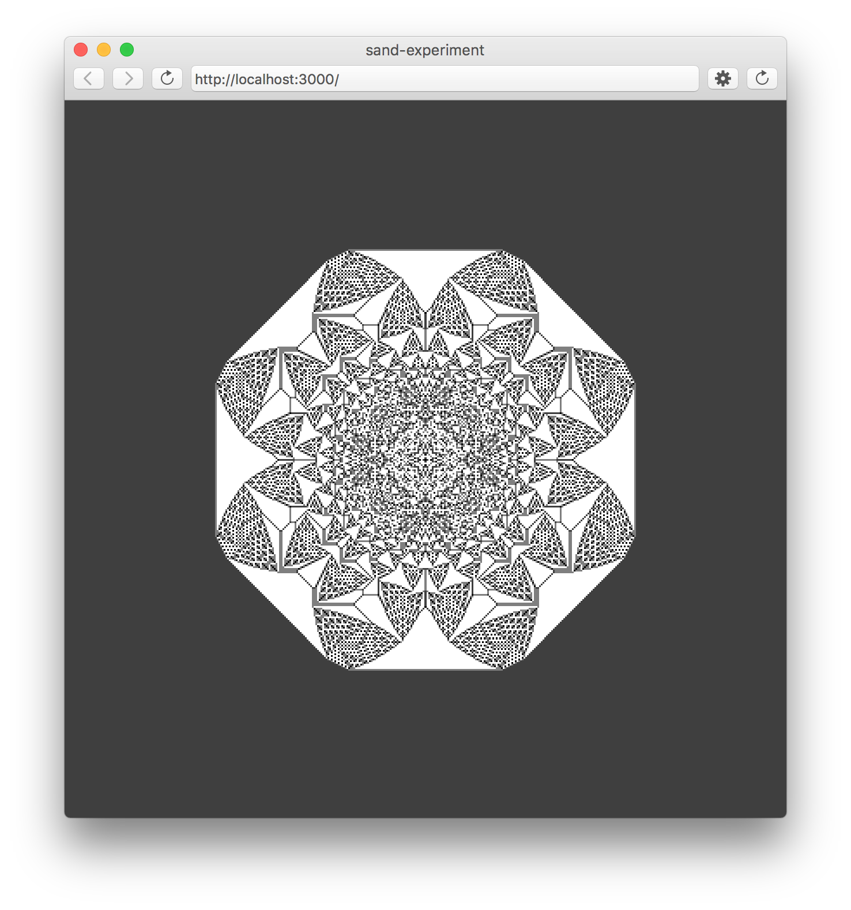

# ... but will it blend ???
## shaders

*Pixel shaders or fragment shaders are used to render textures on your GPU.  
Pixel shaders are written in GLSL*.

## intro to OpenGL + shaders #

Types of shaders

* 3D shaders
  * Vertex shaders (render the vertices of a 3D mesh)
  * Geometry Shaders (modify the geometry of the mesh)
  *  Tesselation Shaders (modify level of detail)
* 2D shaders
  * pixel shaders (render individual pixels on a quad = 2 triangles)
* Sound shaders
  * using shader syntax to mess with sound

### sections

* [programming cells](bwib-2-1)
* [intro to glsl](bwib-2-2)
* [shadertoy](bwib-2-3)
* [neurovision](bwib-2-4)

### Shader Sandboxes ###

A somewhat outdate comparison of shader sandboxes can be found [here](http://perceptify.com/neurovision/2013/05/01/shader-sandboxes-compared/).

## examples

### Game of Sand ###

###### Sand on the Empty Plane ######

###### Sand on a Plane filled with one Grain per Cell #####

###### Sand on a Plane filled with two Grains per Cell #######

## Links

* [GLSL Sandboxes](http://glsl.heroku.com/)
* [WebGL Playground](http://webglplayground.net/)
* [PixelShaders](http://pixelshaders.com/)
* **[Fractal Lab](http://hirnsohle.de/test/fractalLab/)**
* **[Neurovision](http://perceptify.com/neurovision/)**
* **[Shadertoy](http://shadertoy.com/)**
